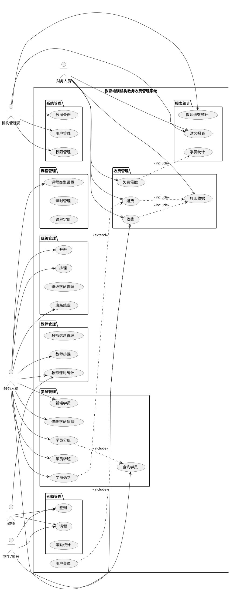
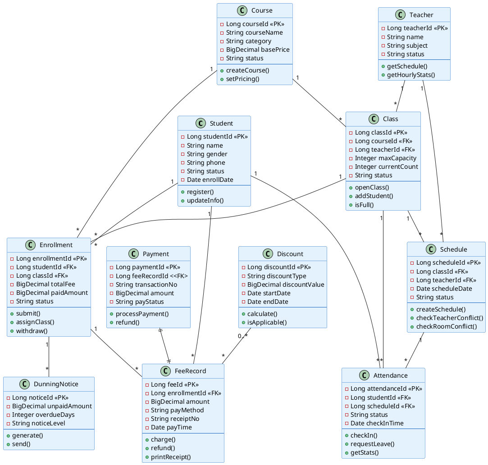
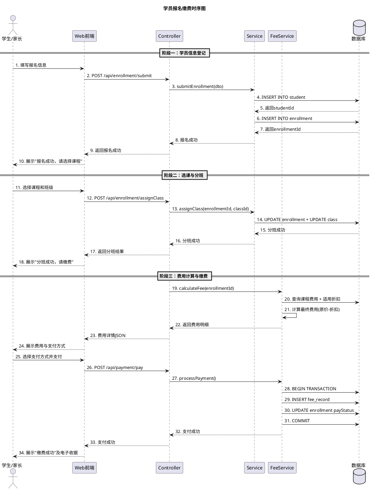
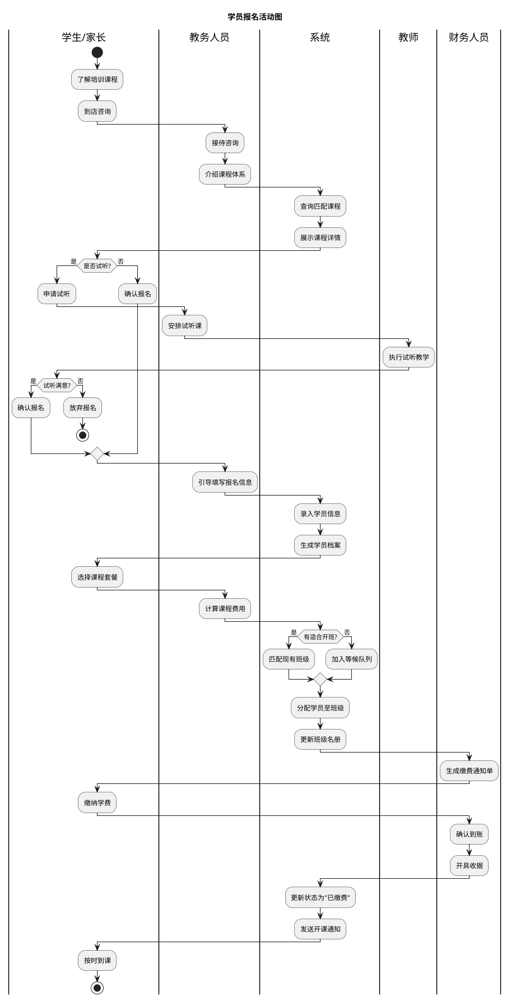
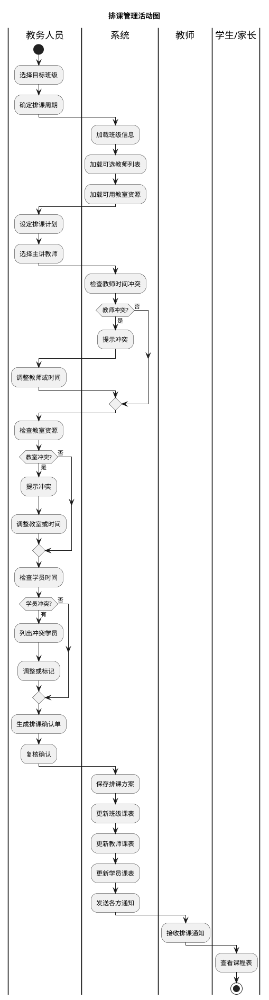

# 📊 UML 模型总览

> 教育培训机构教务收费管理系统（EduFeeMS）
> 共 6 份 UML 模型 | 基线编号 BL-20260622-01

---

## 一、用例图 — 系统功能全景



---

## 二、类图 — 核心领域模型



---

## 三、时序图 — 学员报名缴费全流程



---

## 四、活动图 — 学员报名业务流程



---

## 五、活动图 — 收费管理流程

```plantuml
@startuml 收费管理活动图
title 收费管理活动图

== 流程一：学费收取 ==
|教务人员|
start
:选择目标学员;

|系统|
:加载学员课程列表;
:计算应缴费用;
:确认费用明细;

|教务人员|
:确认缴费金额;
:选择支付方式;

|系统|
if (支付成功?) then (是)
    :更新缴费状态;
    :生成电子收据;
    :写入收费台账;
    stop
else (否)
    :记录失败日志;
    :提示重新支付;
    detach
endif

== 流程二：退费处理 ==
|学生/家长|
start
:提交退费申请;

|教务人员|
:核实信息与缴费记录;

if (符合退费条件?) then (是)
    :核算应退金额;
    :提交财务审批;
else (否)
    :驳回申请;
    stop
endif

|财务人员|
:接收退费审批;
:复核退费金额;

if (大额需管理员审批?) then (是)
    |机构管理员|
    :审批退费申请;
endif

|财务人员|
:执行退费操作;
:更新收费台账;
:生成退费凭证;
stop

== 流程三：欠费催缴 ==
|系统|
start
:定时扫描欠费数据;

:根据逾期天数分级;
:一级(≤7天): 温和提醒;
:二级(≤30天): 正式催缴;
:三级(>30天): 严重警告;

:推送催缴通知;

|学生/家长|
:收到通知后缴费;

|系统|
:更新催缴状态;
stop
@enduml
```

---

## 六、活动图 — 排课管理流程



---

> 💡 **提示**：以上所有 UML 图的完整源文件位于 `wiki/summaries/` 目录下（6个 .puml 文件）。
> 在 Obsidian 阅读模式下，PlantUML 插件会自动渲染以上代码块为图形。
